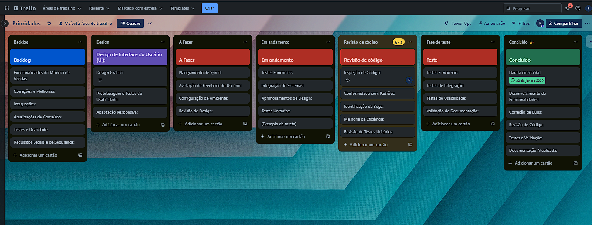

# 🧪 Uc_QualidadeSoftware

**Engenharia de Software • Qualidade de Código • Testes Automatizados**

Este repositório é dedicado ao estudo e aplicação prática de Engenharia de Software com foco em Qualidade, reunindo exemplos reais de código, testes automatizados e boas práticas utilizadas em ambientes profissionais.

O objetivo é demonstrar, na prática, como garantir robustez, confiabilidade, manutenibilidade e evolução segura do software, utilizando padrões consolidados da indústria.

---

## 🎯 Objetivo do Projeto

Promover a excelência no desenvolvimento de software por meio de qualidade de código, testes automatizados, organização e padronização, prevenção de falhas e regressões e aplicação de boas práticas de engenharia.

Este projeto é voltado tanto para aprendizado técnico quanto para demonstração de competência profissional em qualidade de software.

---

## 🧠 Conceitos Abordados

Engenharia de Software, Qualidade de Software, Testes Automatizados, Manutenibilidade, Confiabilidade, Versionamento com Git, Organização modular de código e Boas práticas de desenvolvimento.

---

## 📂 Conteúdo do Repositório

O repositório contém códigos exemplificando conceitos de qualidade de software, testes automatizados utilizando JUnit, estrutura organizada para facilitar manutenção e evolução, scripts e configurações para ambiente de desenvolvimento e materiais de apoio e documentação técnica.

---

## 🧪 Testes Automatizados

O projeto utiliza o framework JUnit para garantir a qualidade e confiabilidade do código. A aplicação de testes automatizados permite detecção precoce de erros, prevenção de regressões, maior segurança em refatorações, aumento da confiabilidade do sistema e facilidade de manutenção.

### Execução dos testes

Os testes automatizados podem ser executados utilizando Maven com o comando mvn test, utilizando Gradle com o comando gradle test ou diretamente pela IDE, executando as classes de teste localizadas no diretório src/test/java.

---

## ⚙️ Configuração do Ambiente

Para executar e contribuir com o projeto é necessário possuir Java JDK 8 ou superior, Maven ou Gradle e uma IDE com suporte a Java, como IntelliJ IDEA, Eclipse ou VS Code.

Clonagem do repositório:
git clone https://github.com/DevFabricioLopes/Uc_QualidadeSoftware.git
cd Uc_QualidadeSoftware

Instalação das dependências:
Com Maven: mvn clean install
Com Gradle: gradle build

---

## 📊 Gestão do Projeto

Durante o desenvolvimento foi utilizado um quadro Kanban para organização e acompanhamento das atividades, permitindo controle de tarefas, acompanhamento de progresso e garantia de qualidade ao longo do ciclo de desenvolvimento.

---

## 🤝 Contribuição

Contribuições são bem-vindas e seguem boas práticas de engenharia de software. O fluxo recomendado inclui fork do repositório, criação de branch para feature ou correção, commit das alterações, envio para o fork e abertura de Pull Request. É esperado que novas contribuições incluam testes automatizados, mantenham a cobertura de testes e sigam padrões de organização e nomenclatura.

---

## 🚀 Tecnologias Utilizadas

Java, JUnit, Maven, Gradle e Git.

---

## 👤 Autor

Fabricio Lopes  
Desenvolvedor de Software  
Engenharia de Software • Qualidade • Testes Automatizados
